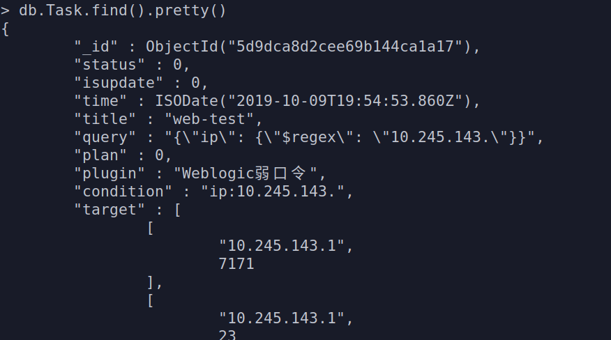

# 巡风使用指南（Ubuntu）
## 安装与部署
### 一.准备
1.切换到root帐号（Ubuntu默认未开启root，使用sudo passwd root开启，然后su root即可切换）  
2.下载源代码到/root目录下
`
git clone https://github.com/ysrc/xunfeng.git
 `  
3.修改当前时区为 Asia/Shanghai
```
echo TZ\='Asia/Shanghai'\; export TZ >> ~/.bash\_profile && source ~/.bash\_profile
```
### 二.环境安装
1.操作系统依赖
```
apt-get update  
apt-get install gcc libssl-dev libffi-dev python-dev libpcap-dev
```
2.python依赖库（使用pip管理）  
如果未安装pip，可按以下命令安装：
```
wget https://sec.ly.com/mirror/get-pip.py --no-check-certificate  
python get-pip.py  
```
更新pip到最新版本:  
```
pip install -U pip
```
安装python依赖（使用豆瓣源）:
```
cd ~/xunfeng
pip install -r requirements.txt -i https://pypi.doubanio.com/simple/
```
3.安装数据库
```
mkdir /var/lib/mongodb/
```
下载并解压MongoDB：
```
cd ~/
wget https://sec.ly.com/mirror/mongodb-linux-x86_64-3.4.0.tgz
tar -xvzf mongodb-linux-x86_64-3.4.0.tgz
cd mongodb-linux-x86_64-3.4.0/bin/
```
添加环境变量：
```
ln -s /root/mongodb-linux-x86_64-3.4.0/bin/* /usr/bin/
```
启动MongoDB：
```
cd ~/
mongod --dbpath /var/lib/mongodb/
```
执行完毕后请新建一个新的终端进行后续操作  
执行如下命令查看 mongodb 是否成功启动:
```
netstat -antlp | grep 27017
```  
### 三.部署与配置
1.数据库  
MongoDB添加认证：
```
# mongo
> use xunfeng
> db.createUser({user:'chj',pwd:'chj',roles:[{role:'dbOwner',db:'xunfeng'}]})
```
这里的user和pwd需要更换为你的mongodb的账户和密码。  
导入数据库：
```
cd ~/xunfeng/db
mongorestore -h 127.0.0.1 --port 27017 -d xunfeng .
```
最后回到刚才启动数据库的终端Ctrl+C关闭  
2.巡风配置 xunfeng/config.py  
修改web端登录配置：
```
class Config(object):
    ACCOUNT = 'admin'
    PASSWORD = 'xunfeng321'
```
修改数据库配置：
```
class ProductionConfig(Config):
    DB = '127.0.0.1'
    PORT = 27017
    DBUSERNAME = 'chj'
    DBPASSWORD = 'chj'
    DBNAME = 'xunfeng'
```
3.运行  
修改run.sh中的端口（或根据实际情况修改）：
```
nohup mongod --port 27017 --dbpath=${XUNFENG_DB} --auth  > ${XUNFENG_LOG}/db.log &
```
运行：
```
sh run.sh
```
P.S. 如果提示nohup: 重定向标准错误到标准输出，则添加2>&1：
```
nohup mongod --port 65521 --dbpath=${XUNFENG_DB} --auth  > ${XUNFENG_LOG}/db.log 2>&1 &
nohup python web.py  > ${XUNFENG_LOG}/web.log 2>&1 &
nohup python aider/aider.py > ${XUNFENG_LOG}/aider.log 2>&1 &
nohup python nascan/nascan.py > ${XUNFENG_LOG}/scan.log 2>&1 &
nohup python vulscan/vulscan.py > ${XUNFENG_LOG}/vul.log 2>&1 &
```
终止：
```
ps -f #查看相应的5个进程
kill -9 [process id]
```
## 使用Masscan
### 一.准备
xunfeng内置编译好的Masscan程序，若不合适可以自行编译安装  
给予Masscan执行权限：
```
cd ~/xunfeng/masscan/linux_64
chmod ug+x ./masscan
```
### 二.配置
运行xunfeng，浏览器打开127.0.0.1登录web端  
进入 配置-爬虫引擎 进行相应配置：
启用MASSCAN， 网络资产探测列表(必填)  
启用后可以进入/var/log/xunfeng/查看各类日志：
```
aider.log  db.log  scan.log  vul.log  web.log
```
这里配置：
```
网络资产探测列表：10.245.143.0/24（本机ip需配置在相同网段）
```
### 三.查看结果
1.web端  
在[统计]可以查看统计信息  
在[搜索]可以按各类条件搜索结果，比如：
ip:10.245.143. 可以查询该网段下的结果  
2.mongodb端  
登录mongodb:
```
mongo
> use xunfeng
```
认证：
```
db.auth('chj','chj')  #输入配置的帐号和密码
```
查看集合:
```
> show collections
Config
Heartbeat
History
Info
Plugin
Result
Statistics
Task
Update
```
Masscan结果存在Info里:
```
> db.Info.find().pretty()  #查询全部数据
...
> db.Info.find({"ip":"10.245.143.100"}).pretty()  #查询
...
```
Info的字段信息：
```
{
	"_id" : ObjectId("5d7462b9ef105f35d7b73a05"),
	"ip" : "10.245.143.100",
	"hostname" : "ACK1Y",
	"time" : ISODate("2019-09-08T10:08:57.900Z"),
	"banner" : "",
	"port" : 62110
}
```
## nascan（nascan.py）分析
Config的字段信息(type=nascan)：
```
{
	"_id" : ObjectId("580d76590706aabc1a13ccfb"),
	"type" : "nascan",
	"config" : {
		"Scan_list" : {
			"value" : "10.245.143.0/24",
			"info" : "网络资产探测列表(必填)",
			"help" : "指定爬虫引擎探测范围，格式：192.168.1.1-192.168.1.254(修改会立刻触发资产扫描收集)"
		},
		"Discern_cms" : {...},
		"Discern_con" : {...},
		"Discern_lang" : {...},
		"Discern_server" : {...},
		"Port_list" : {...},
		"Masscan" : {...},
		"Timeout" : {...},
		"Cycle" : {..},
		"Thread" : {...},
		"White_list" : {...}
	}
}
```
Statistics的字段信息：
```
{
	"_id" : ObjectId("5d745ca81f12a0b08d20e849"),
	"date" : "2019-09-08",
	"info" : {
		"add" : 121,
		"update" : 0,
		"delete" : 0
	}
}
```
1. 主线程（共有3个固定线程）  
python变量:  
&#8195;CONFIG_INI: 对应数据库中的Config集合
（这里指type为nascan的文档）  
&#8195;STATISTICS: 对应数据库中的Statistics集合  
&#8195;MASSCAN_AC: [0]标志masscan是否正在扫描  
&#8195;NACHANGE: [0]标志nascan的config是否有更新  
&#8195;ac_data: 已执行过扫描的日期（变量名应改为ac_date）  
逻辑:  
&#8195;启动monitor和cruise线程  
&#8195;进入扫描死循环  
&#8195;处于扫描时段或者config更新时进行扫描，跳到start.run()
2. 心跳线程monitor  
每30s在集合中:  
&#8195;Heartbeat: 更新心跳时间（当前时间）  
&#8195;Config: 获取配置信息到CONFIG_INI  
&#8195;Statistics: 用STATISTICS更新统计信息
3. 失效记录删除线程cruise  
工作时间时每3600s在集合中:  
&#8195;Info: 遍历，删除连接失效的(ip,port)  
&#8195;History: 插入失效的记录  
&#8195;并且更新STATISTICS变量
4. start的run方法  
self.mode: 是否启用Masscan  
self.queue: 待扫描的ip  
全局变量:  
&#8195;AC_PORT_LIST: 记录Masscan的扫描结果  
局部变量:  
&#8195;all_ip_list:   
逻辑:  
&#8195;根据self.mode选择使用Masscan扫描的结果或指定的端口列表  
&#8195;跳到start.scan_start()
5. start的scan_start方法  
self.thread: config中的最大线程数  
开启self.thread个ThreadNum线程类  
然后等待所有线程结束
6. ThreadNum  
其从传入的queue中获取单一host  
然后执行scan.py中的scan.run()  
scan.run()执行单一host的端口扫描以及服务识别

## nmap插件（端口扫描）
1. 可以代替masscan作全端口扫描，也可以根据默认端口列表过滤
  
表Config中type=nascan的文档里    
config.Masscan.value更新  
第一个值对应xunfeng/nascan/lib/start.py中的mode，可取:  
0,1,2,3分别对应上图端口扫描的4个方式    
此外新增两个值，一个对应nmap_portscan_thread,另一个nmap_options
```
"Masscan" : {
			"value" : "3|20000|/root/xunfeng/masscan/linux_64/masscan|5|-sS -n",
			"info" : "端口扫描",
			"help" : "可启用MASSCAN(自行安装)代替默认的端口扫描方式，路径地址需配置全路径，MASSCAN探测端口范围为1-65535且强制进行ICMP存活检测，请根据网络实际情况设置发包速率。\n也可启用nmap，端口范围默认为1-65535，根据实际情况设置使用nmap的最大线程数。"
}
```
2. 如果使用nmap进行端口扫描，即mode为2或3  
则在类start的run方法中执行进入nmap_scanport方法（host一个个循环传入）  
在nmap_scanport方法中，传入host的端口列表平均分配给每个线程（线程数为nmap_portscan_thread），然后每个线程调用plugin/nmap.py中nmap的类方法port_scan进行相应端口的扫描，返回结果为状态open的端口

## vulscan漏洞扫描
### Task表字段信息

执行一次：

每月执行：（注意plan）

P.S. plan字段表示执行周期，特别地，0表示执行一次
### 漏扫主程序vulscan.py
从`if __name__ == '__main__':`进入：
1. init()加载插件
2. 开三个线程
3. 循环取出Task表中的任务并执行

传入vulscan类的参数：
1. task_id: (形如"_id" : ObjectId("5d9dcb2a2cee69b144ca1a1e"))
2. task_netloc: 来自task_target(Task表中的target字段)  
形如["10.245.143.1",7167]
3. task_plugin: 插件名称